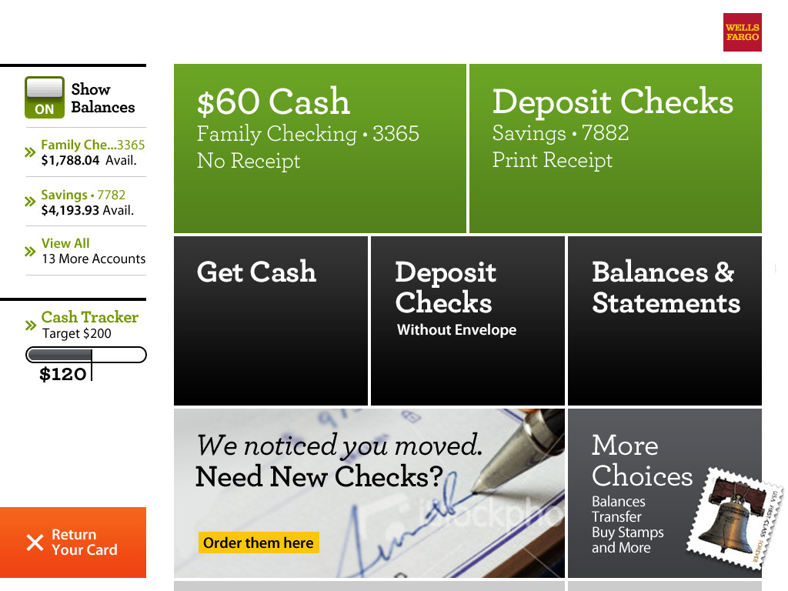

> **CSC 362 • Database Systems • Fall 2024**
# Lecture 1 - Intro

Notes:
- have Eclipse project prepped and ready to demo
- print syllabus & [fig 1.1](./fig-1-1.pdf)


## Questions to be answered:
1. What is special about database systems?
2. What are the two ways to connect to a database engine and integrate it with an application?
3. What will this course be about?


## Syllabus

Everything is on the Canvas website.
http://cs.berry.edu/csc362


## Data

[](https://www.domo.com/learn/infographic/data-never-sleeps-11)

[](https://www.networkworld.com/wp-content/uploads/2023/11/autonomous-vehicle-data-intel-100697604-orig.jpg?quality=50&strip=all)




## Data and Databases and Database Management Systems
> [Notes based on class notes by Dr. Edward Sciore.]


- What is a database? What does a DBMS do?
    - When you use a database, you tend to look at the UI.
    - From this point of view, the database is software that holds data for you, and displays it for you in various ways.

- When we separate the UI from the database engine, we see it from a very different perspective.
    - The database engine provides an API for storing and retrieving data.
    – The client of the engine can do anything it wants with the data.
    
    - Draw a picture: physical disk, data(base), OS, DBMS, UI/application


## What makes database systems so special?

- Show [Fig 1.1](./fig-1-1.pdf). (handout)
- Why can't you just use a text editor, or a spreadsheet?
    - Spreadsheets don’t separate the data from the calculations.
    - Spreadsheets don’t express data relationships well. 
    - Spreadsheets are (generally) not accessible by multiple users simultaneously.
    - Spreadsheets are not scalable.
        > https://www.keenesystems.com/blog/5-reasons-a-database-is-better-than-a-spreadsheet-for-business

[ChatGPT response](./chatgpt-db-vs-xls.md)


## Five Key Features/Requirements of a DBMS

- Persistence
- Concurrency
- Consistency
- Scalability
- Usability

### Persistance

Attained by storing data "records" as files on disk.

- Need to be able to read/write selected portions of the data.
    – To read/write a text file, must get it all.
- Disk access is slowwww.
    - Sequentially reading/writing a text file/spreadsheet is very inefficient.

Databases use efficient file structures analogous to efficient in-memory data structures to organize persistent data.
- Requires creating auxiliary files, e.g. *indexes*.

### Concurrency

- "Simultaneous" multi-user access.
    - avoid "race conditions"...

### Consistency

- Make sure that *transactions* are managed so that data doesn't become corrupted
- Be able to recover gracefully from crashes and reconstruct an accurate version of the data.

### Scalability

- Need to be able to scale to huge amounts of data, transparently.

> [page 5] In other words, a database system is faced with the following conundrum: It must manage **more** data than main memory systems, using **slower** devices, with **multiple people** fighting over access to the data, and make it **completely recoverable**, all the while maintaining a reasonable response time.

- Achieved through forms of *caching*.

>> Imagine a college degree requiring 300 credit hours (instead of 120), with courses that meet half as often, and people dropping in and out of courses arbitrarily, but we have to ensure they still get all the info they need to know and not miss anything, and still graduate in 4 years. That's the magic that a database system pulls off!


### Usability

Allow users to express complex queries (search/update operations) on the data using easy and concise language (a *query language*)
See Fig 1.3 vs SQL statement (page 6).


## This course!

We will learn how a database engine satisfies these requirements and provides these features:

- a separate file system from that of the OS, for managing disk usage efficiently;
- recovery techniques, for ensuring database integrity when the system crashes;
- mechanisms to handle concurrent accesses from multiple users;
- a language compiler/interpreter, for processing user queries;
- query rewrite strategies, for transforming inefficient queries into efficient ones;
- complex algorithms for indexing data, to support fast access.


## Quizizz

https://quizizz.com/admin/quiz/66a0273dc8c66c6415b4828d?source=quiz_share


## SQL

- SQL is the standard query language between clients and database engines.
- A SQL statement is composed of three basic clauses: `select ... from ... where`
    - The result of a query is a table

For example:

```
select sid, sname 
from student 
where majorid=20 and gradyear=2020

select gradyear 
from student 
where sname = 'joe'

select sname, gradyear 
from student
```

- The `where` clause specifies the subset of rows to use. The `select` clause specifies the columns to use.
- The `where` clause is optional.
- Capitalization and spacing is important only inside quotes.
- Note that quotes are single quotes, not double quotes.
    - Sort order is irrelevant.

## The SimpleDB Database System
- The purpose of this course is to understand how database clients and engines work.
    - However, we can't look at the code of a commercial system, because they are too large and complex.  It would take forever to figure it out.
- Therefore, we'll look at how SimpleDB works.
    - SimpleDB is a small system, written in Java.
    - We'll spend a lot of time looking at its source code.


## Embedded vs Network Engines

Draw a picture, like https://www.mcobject.com/embedded-or-client-server/

Embedded example: Browser storage (demo - developer tools)

- Embedded engine is generally for single user, personal data
- Network engine supports shared data, multiple users


## Demo code along the way


## Go over: [Project 0](./project00.md)

