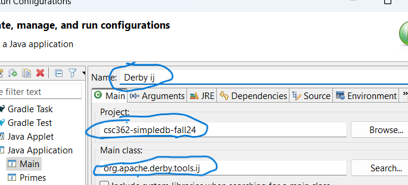
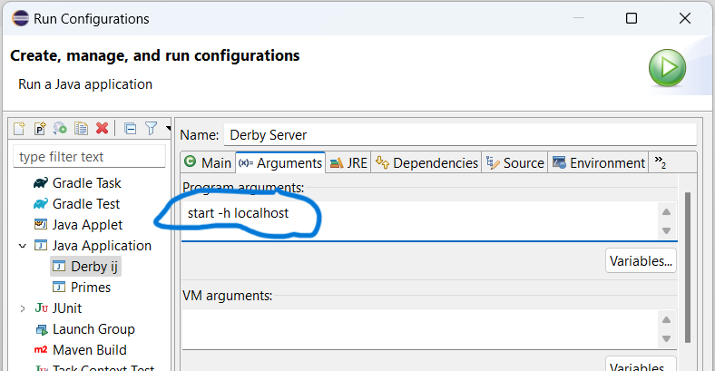

> **CSC 362 • Database Systems • Fall 2024**
# Project 0: Setup & SQL

## Part 1: Eclipse IDE and SimpleDB Setup

> Install the Eclipse IDE and set up the SimpleDB project by cloning the GitHub repo.

1. Download the installer from https://www.eclipse.org/
2. Run the installer and choose the ["Eclipse IDE for Java Developers" option](./eclipse-inst.png).
3. Launch the IDE and choose a location for your workspace folder.
4. From the "Window" menu, choose "Show View" -> "Other...". Then, under "Git", choose "Git Repositories".
5. In the *Git Repositories* view (usually appears in the bottom left of the workspace), choose "Clone a Git repository".
6. Copy this GitHub repo URL:
    > https://github.com/nadeemabdulhamid/csc362-simpledb-fall24.git
6. Select "Clone URI" in the *Select Repository Source* window and click "Next".
7. Paste the repo URL from above as the URI (Eclipse may automatically fill it in for you if you previously copied it), and click "Next" twice.
8. Select the directory on your computer where you want to save the repository folder (you may just accept the default suggestion). Click "Finish" when done.
9. The repository should appear listed in the "Git Repositories" view. Right-click on it and choose "Import Projects...". Just leave all the suggested defaults and choose "Finish".
10. The project should appear in the Project Explorer (top-left area of the IDE) with a "src" folder and a bunch of `simpledb` subpackages.
11. Download the 5 JAR files from the [`libs` subdirectory here](../libs/).
12. Drag the 5 JAR files onto the `csc362-simpledb-fall24` project. ("Copy files" if prompted)
13. Right-click the 5 JAR files in your Eclipse project, choose "Build Path" -> "Add to Build Path".
14. Your project should look something like this: [screenshot](./eclipse-proj.png). If the packages are all named `src.simpledb....` instead of being grouped under an expandable `src` folder, right-click on the project, choose "Build Path" -> "Configure Build Path". On the "Source" tab, choose "Add Folder...", make sure the "src" subfolder is clicked (instead of "csc362-simpledb-fall24`) in the "Source Folder Selection" window. Then click "OK" and "Apply and Close".

There should now be no errors in your Eclipse project.

## Part 2: Run Configurations

> Set up and test run configurations.

1. Follow the instructions on page 7 of the textbook, second paragraph, to set up a **new** run configuration for the Derby ij application.
    

2. Follow the instructions on page 9 of the textbook, third paragraph, to set up a **new** run configuration for the Derby network server application. Make sure you set up the arguments tab. .

3. Finally, in the `simpleclient` package of the `src` open the `SimpleIJ.java` file and run it to test it, following the description of its use at the bottom of page 10 onto 11 in the textbook.

## Part 3: Running the Embedded Client Programs

A. Ensure that you can create the SimpleDB student database in embedded mode, as follows:

- Run `CreateStudentDB` in the `simpleclient.embedded` package. It will create a database named `studentdb` having the same tables as in Figure 1.1 of the text. The actions taken by the engine will be displayed in the console window.

- Refresh your Eclipse workspace ("File" -> "Refresh"). You should see a subfolder named `studentdb` in your simpledb project. This folder is where SimpleDB stores the contents of the database you just created. (Take a look!) Any time that you make a change to the database, that change will be reflected in the contents of this folder. (Do not otherwise mess with anything in the folder - that will corrupt the state of the database.)

- Run `StudentMajor.java`. It should open a console window and display 9 records
showing the names of the students and their majors.

- Run the `ChangeMajor.java` client, which will change the `MajorId` value of Amy’s record in the `STUDENT` table. Re-run the `StudentMajor` program to verify this.

- Run `CreateStudentDB` again. This causes duplicate records to be inserted into
the database. To verify this, re-run `StudentMajor` and note that there are two
records for each student. Interestingly, the records for Amy have different majors;
do you see why?

B. Delete the database and re-create it, as follows:

- From the Eclipse client project, delete the folder containing the files for the
`studentdb` database. Congratulations! You just destroyed the database.

- Now re-create the database, by simply re-running `CreateStudentDB`. Refresh the
workspace to see that the database folder has been recreated.

## Part 4: Running the SimpleDB Server Engine and Client Programs

1. Run the `StartServer.java` program in the `simpledb.server` package. A console window should appear indicating that the SimpleDB server created a new database and is ready.

2. Look in the `simpleclient.network` package. *While the server from step 1 is still running*, first run the `CreateStudentDB` client and then
`StudentMajor`. Although their output should be the same as in step A of Part 3, it will be displayed in separate console windows — one window for the server, and one for the client. By default, Eclipse displays these windows on top of each other. To
toggle between them, click the “Display selected console window” icon (which is
the 10th icon from the left at the top right of the console window).

3. Shut down the server by going to its console window and clicking on the red
square near its top. Run `StudentMajor` again. You should get an error message.

4. Rerun the server, then run `StudentMajor`. It should now work. You may have many duplicate records by this point. You can always clear the database by deleting the `studentdb` subfolder and running `CreateStudentDB` afresh.

## Part 5: Running the SimpleIJ Client Demo

1. Run the program `SimpleIJ.java`, which is in the `simpleclient` package.

2. Its console window displays `Connect>`. This message asks you to enter a
connection string. Enter the following string, which will establish a connection to
the embedded database:

        jdbc:simpledb:studentdb

3. The client now displays `SQL>`, which asks you to enter an SQL query. Type the
following query to print the name and majorid of all students.

        select sname, majorid from student

    Pressing the `Enter` key will cause the program to execute the query and print its results.

4. Type `exit` to terminate the program.

5. Assuming that the server is still running, re-run `SimpleIJ`. This time, enter the following network connection string, which will connect you to the network
database. (If your server is not running, it will show an error message).

        jdbc:simpledb://localhost

5. Type the same query as before.

6. If you know SQL, enter some other queries into SimpleIJ. (Keep in mind that the
program expects the entire query to be on a single line.) You can figure out the
names of the tables and their fields by looking at Figure 1.1 of the text. Section
1.5 of the text describes the subset of SQL supported by SimpleDB. What
happens when you execute an SQL statement that SimpleDB doesn't support?

7. Type `exit` to terminate the program. Then shut down the server (by clicking on
the red square near the top of its console window).

~

## Part 6: (Optional) SQL Warmup

If you are not familiar with SQL, you may work through the interactive exercises at ***https://sqlbolt.com*** to become familiar with it. 

~

## Wrap-up

A. Write a 10 page paper describing what you learned.
- Just kidding. Don’t do that.
- On the other hand, if you don’t understand what I asked you to do, then try again.
If you still are perplexed then ask me.

B. Configuring a system is often deceptively difficult.
- The point of this assignment is to ensure that your system is properly configured,
and to get you totally comfortable using it.
- Later homework assignments will ask you to change the code for the system.
The time you spend now getting comfortable with the system will make it possible
for you to debug your future code confidently and effectively.

C. Use version control.
- As you make changes to the code in future projects, use the "Team" context menu (right-click on the project) to manage your local Git repository. The following video may be helpful to see a common workflow pattern. (The only difference is that you do not have permissions to push your local changes back to the remote branch, on GitHub. Nonetheless, you still have all the benefit of being able to manage changes and history on your own computer.) Also note, the interface (buttons/windows) on the latest version of Eclipse is quite different, but the concepts and process are the same.
    - https://youtu.be/rblGZRWqFVI

