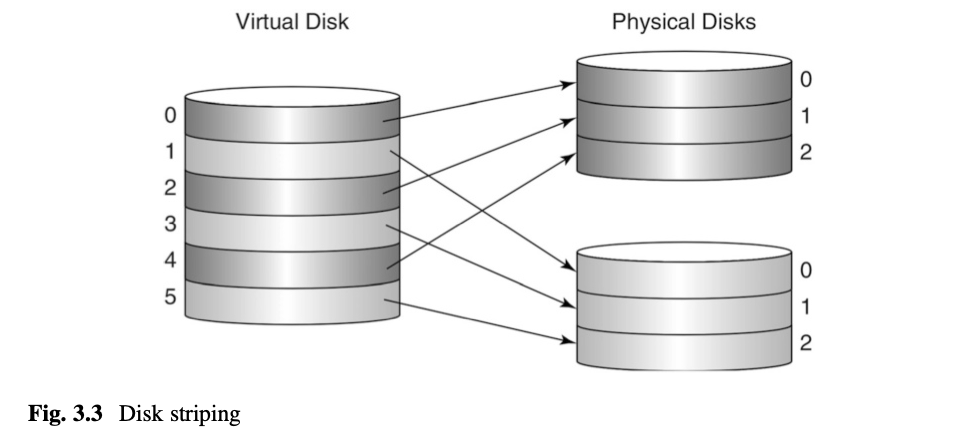
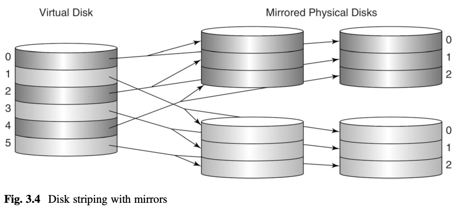
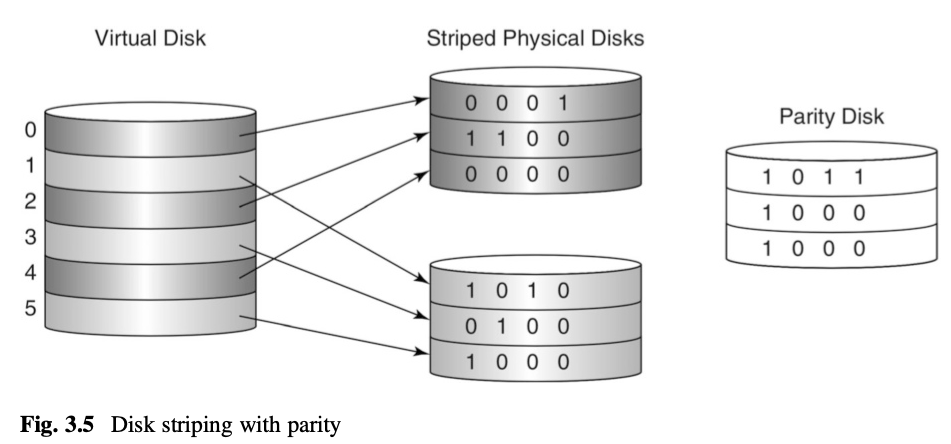

> **CSC 362 • Database Systems • Fall 2024**
# Lecture 3 - Disks

## Questions to be answered:
1. What are the parts of a hard disk drive and how do they physically work?
2. What is involved in a disk access? How is (average) access time calculated?
3. How do RAID techniques improve reliability and/or access time?


## Disk storage

- disk drive
- platter, track, arm, actuator
- *capacity*: # of bytes
- *rotation speed*: (revolutions per minute) e.g. 5400 - 15000 rpm
- *transfer rate*: (bytes per second) e.g. 100 MB/s, = rotational speed * bytes per track
- *seek time*: to physically move the actuator to be over the right track e.g. 15-20 ms (avg. 5ms)

Example pg. 51: capacity, transfer rate

- Average time to access X bytes = seek time + rotational delay + transfer time
- *rotational delay*: time for platter to rotate until the first byte is under disk head (in seconds/ms) = 1/rpm * .5 * convert to seconds
    - seek time & rotational delay dominate

- *sector*: smallest unit of data access from disk (e.g. 512 bytes)
    - physical unit used by the disk.  It is determined when the disk is formatted/defined by hardware.
- *block*: smallest unit of data access at the software level (OS, e.g. 4KB, 8KB)
    - OS is responsible for translating a block reference to the appropriate sector reference(s).

### Improving Access Time

- disk caches - fast memory storing 1000s of sectors (prefetching entire tracks of sectors)
- cylinders - set of tracks at the same place on multiple platters (zero additional seek time)
- <details><summary>striping - spread sectors out among multiple disk drives</summary>

    
    </details>

### Improving Reliability

- <details><summary>Mirroring: multiple identical physical disk copies</summary>

    
    </details>
- <details><summary>Parity: use just 1 extra disk</summary>

    
    </details>

### RAID (Redundant Array of Inexpensive Disks)

- Level 0: striping, no redundancy
- Level 1: mirrored striping
- Level 5: striping with distributed parity (avoids one disk becoming bottleneck)


## Block-level OS interface

- The OS methods `readblock` and `writeblock` move pages to/from disk and memory.
    ```
    readblock(int blk#, byte[] page);
    writeblock(int blk#, byte[] page);
    ```

- Blocks are read into memory *pages*, which are essentially an array of bytes

- <details><summary>Example (not in book): incrementing an integer on disk</summary>

    ```
    byte[] page = new byte[400];   // page is 400 bytes
    readblock(12, page);    // not a Java method
    // manipulate the page to increment a 4-byte integer somewhere in it
    writeblock(12, page);   // not a Java method
    ```

    - requires a lot of work (reading & writing a block = slow disk access)
</details>

- How *do* you manipulate a byte array in Java?
    - use `ByteBuffer`
    - <details><summary>Code to increment the value of an integer at bytes 234-237 of block 12</summary>

        ```
        byte[] page = new byte[400];
        readblock(12, page);   // NOT REAL JAVA

        ByteBuffer bb = ByteBuffer.wrap(page);
        bb.position(234);		// position the pointer

        int n = bb.getInt();	// get the 4 bytes at the ptr
                        // and turn it into an int

        bb.position(234);		// reposition the pointer

        bb.putInt(n+1);		// turn the int into 4 bytes
                        // and write them at the ptr

        writeblock(12, page);  // NOT REAL JAVA
        ```
    </details>

### advantage
- DB engine would have control over 
    - how pages are used, 
    - when the disk is written to, 
    - where things are stored on the disk.

### disadvantage 
- too low-level
    - The DB engine will need to allocate and deallocate blocks, and determine how to organize blocks containing records from the same table (esp. as the size of the table grows/changes).
    - this is essentially what a file system does.  
        - So maybe the db engine should use the file system


## File-level OS interface

Provides high-level concept of a *file*: sequence of bytes (arbitrary size)

- Java [`RandomAccessFile`](https://docs.oracle.com/javase/8/docs/api/java/io/RandomAccessFile.html)
    - keeps track of a *file pointer*: byte location in the file where next read/write happens
    - `seek`, `readInt`, `writeInt`, ...
        - –The seek method will automatically allocate blocks to the file. If you seek to a location that does not exist, the method will have the file system automatically create the block for you

- [`simpledb.file.RandomAccessFileTest`](https://github.com/nadeemabdulhamid/csc362-simpledb-fall24/blob/main/src/simpledb/file/RandomAccessFileTest.java)

- When does the disk get written?
    - The “s” arg to the constructor says to write immediately after writeInt.
    - Without it, writing happens at the whim of the OS. 
    - For example, it might save up modifications and write them all at once.
- When does the disk get read?
    - Does the seek method read the block where the file pointer goes?
    - Or does the reading occur during readInt? The OS chooses.
- How does the seek method even know which disk block to use?
    - This is what the OS file system is all about.
    - The text has a brief outline of how file systems work.
        - Contiguous
        - Linked (extent based)
        - Indexed


## DB Engine choices
- If DB engine uses file-level interface, then the OS decides when to do all the reading and writing.  
    - The problem is, the db usually knows how to do things better.
    - This is a serious problem, because:
- The main rule for creating disk-based programs is this:
    - The most important thing is to minimize disk accesses.
    - Anything you do with the data is almost certainly to take an insignificant amount of time in comparison.
- To avoid this, Access and Oracle write their own file system.
- SimpleDB solution:  Use a file for each table, but manage each file as a sequence of blocks. 
