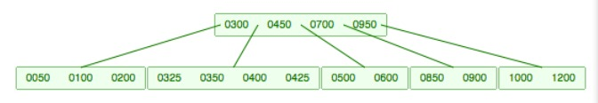
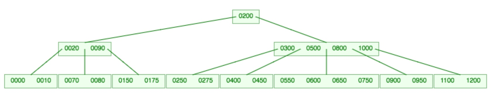
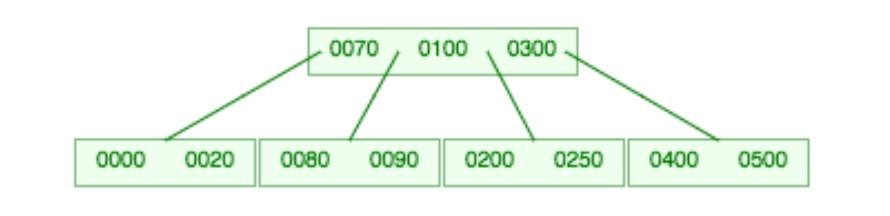
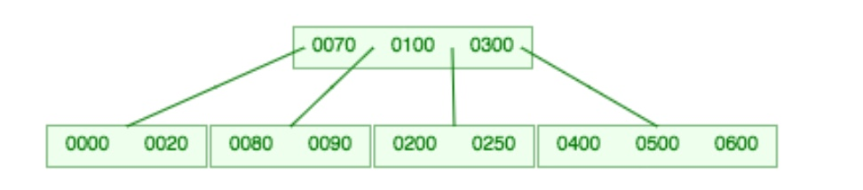
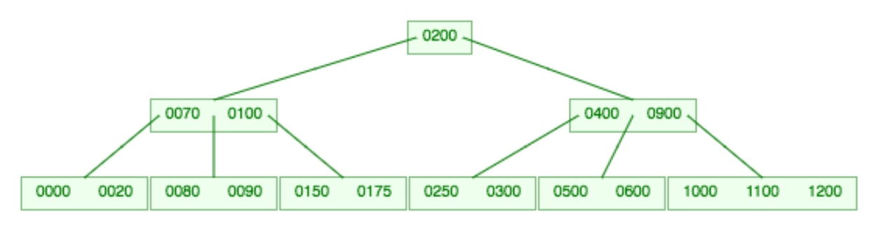
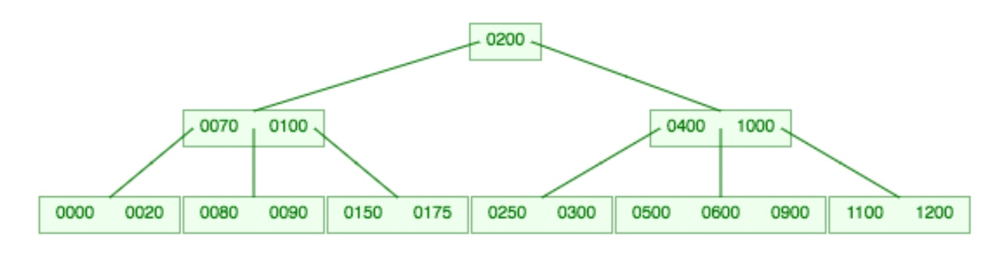
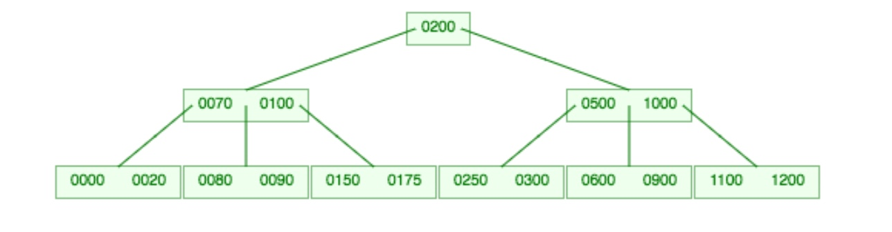

# B-Tree Practice Problems

### 1. Insert 375 into the following B-tree:

### 2. Insert 700 into the following:

### 3. Delete 80 from the following:

### 4. Delete 250 from the following:

### 5. Delete 900 from the following:

The following problems all involve deleting a key from an interior node. Assume we choose to replace the deleted key with the **largest key from its left subtree** (i.e., its immediate predecessor in sorted order) so please solve the following problems by deleting the immediate predecessor from the appropriate leaf and then re-balancing in the appropriate way.

### 6. Delete 400 from the following:

### 7. Delete 100 from the following:

---

Adapted from: https://web.eecs.utk.edu/~bvanderz/teaching/cs140Sp18/BTrees/

